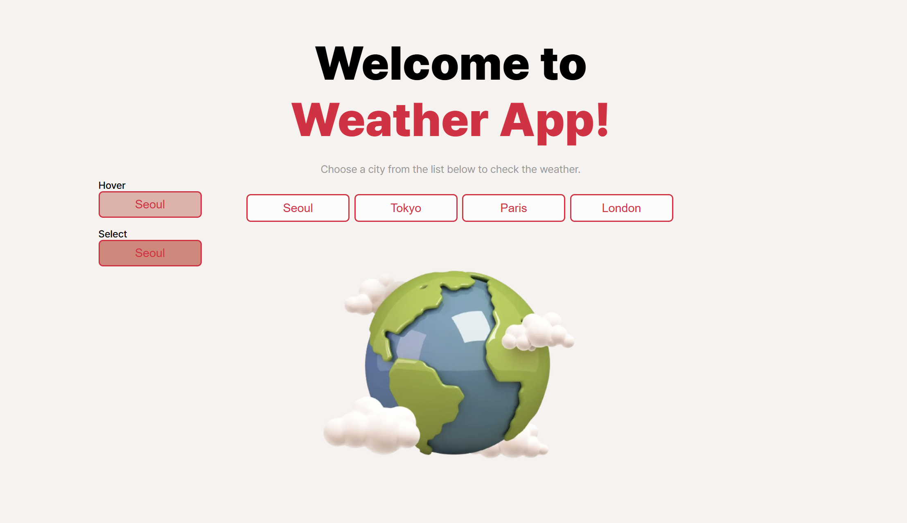
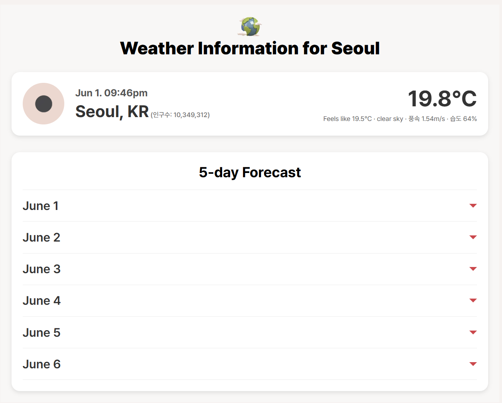
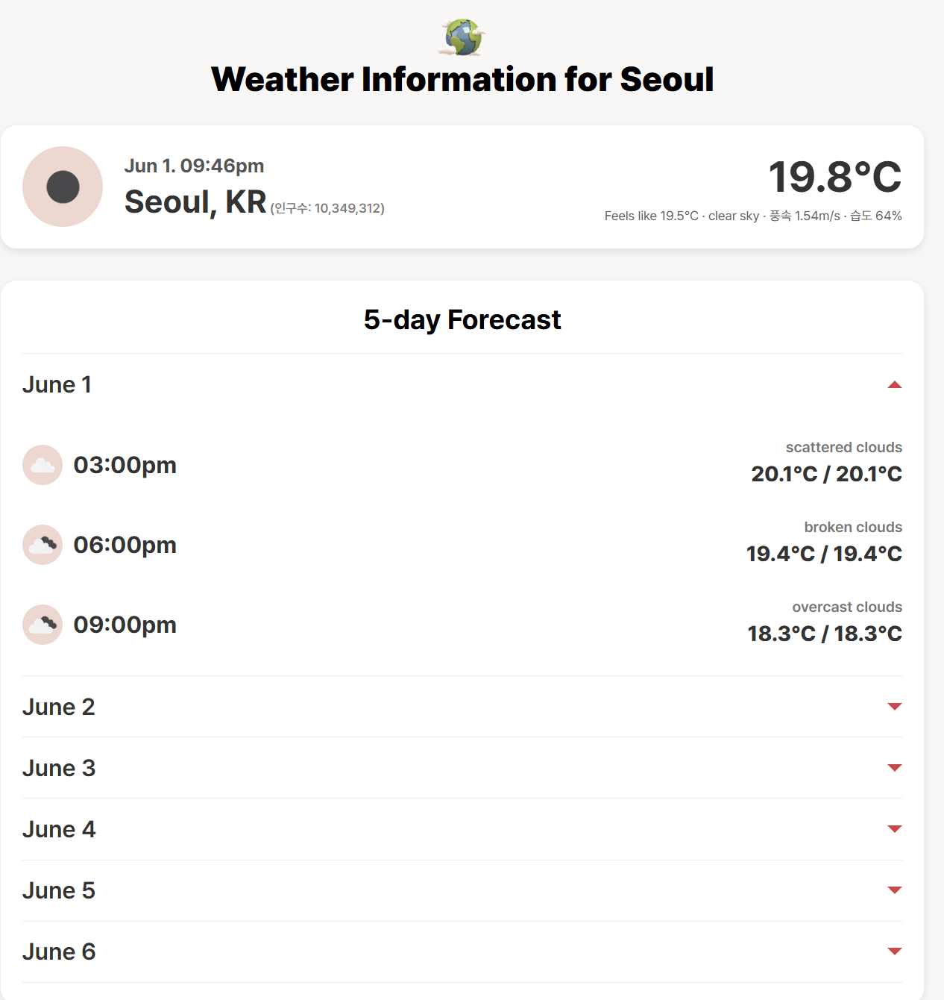

# 🌤️ Weather App

Next.js, Apollo Client, GraphQL을 기반으로 도시별 날씨 정보를 제공하는 웹 애플리케이션을 구현했습니다.  
서울, 도쿄, 파리, 런던 중 한 도시를 선택하면 OpenWeather API를 통해 해당 도시의 현재 날씨 및 5일치 예보를 확인할 수 있습니다.

또한, Jest를 활용한 간단한 유닛 테스트(`formatDisplayTime`)가 포함되어 있습니다.

---

### 메인 페이지



### 상세 페이지 (서울)
- Weather depth_다 접혀있을때


- Weather depth_한 개 펼쳤을 때


---

## 프로젝트 구조

```
weather-app/
├─ pages/              # Next.js 라우팅
│  ├─ index.js         # 메인 페이지 (도시 선택)
│  └─ [city].jsx       # 각 도시의 날씨 페이지
├─ utils/
│  └─ formatTime.js    # 시간 포맷 함수
├─ __tests__/
│  └─ formatTime.test.js  # 단위 테스트
├─ styles/             # CSS 모듈
├─ public/             # 이미지 (예: earth.png)
├─ package.json
├─ jest.config.js
└─ ...
```

---

## 실행 방법

### 1. 의존성 설치

```bash
npm install

## 2. 개발 서버 실행

```bash
npm run dev
```

- 메인 페이지: [http://localhost:3000](http://localhost:3000)
- 메인 페이지에서 도시의 버튼을 클릭하면, 각각의 상세 페이지로 이동된다.
- 각 상세 페이지 주소
    - [http://localhost:3000/Seoul](http://localhost:3000/Seoul)
    - [http://localhost:3000/Tokyo](http://localhost:3000/Tokyo)
    - [http://localhost:3000/Paris](http://localhost:3000/Paris)
    - [http://localhost:3000/London](http://localhost:3000/London)

---

## 테스트 실행

```bash
npm test
```

- 현재 포함된 테스트: `utils/formatTime.js` 함수의 시간 포맷 결과 검증
- 테스트 대상 파일: `__tests__/formatTime.test.js`

---

## 기술 스택

| 분류       | 사용 기술                        |
| ---------- | ------------------------------- |
| 프레임워크 | Next.js 15                      |
| 언어       | JavaScript (ES6+)               |
| 상태 관리  | Apollo Client + GraphQL         |
| API 소스   | OpenWeather API                 |
| 테스트     | Jest, @testing-library/react    |
| 스타일링   | CSS Modules                     |

---

## ❗ 아직 구현되지 않은 과제 (test 관련)

- `babel.config.js` 및 커스텀 Babel 설정을 제거하고 **Next.js 기본 SWC 설정**을 사용하고 있습니다.
- 시간적 여유를 가지고 몇 가지 테스트를 더 도입하려면 `babel.config.js`와 관련 프리셋 설정을 다시 구성할 필요가 있습니다.

---

## 📦 설치된 주요 패키지

```bash
npm install @apollo/client graphql
npm install --save-dev jest @testing-library/react @testing-library/jest-dom babel-jest identity-obj-proxy
```
